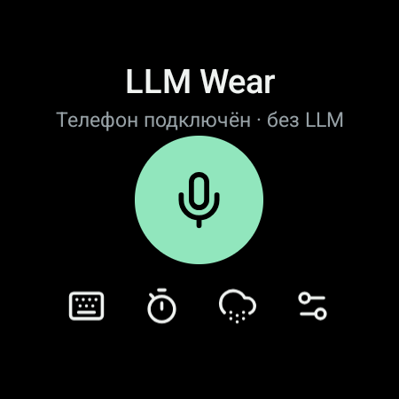
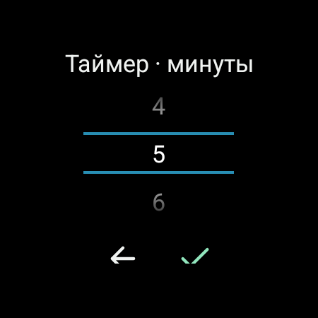

# LLM Wear

Локальный AI-помощник для Android и Wear OS: Gemma работает на телефоне,
а с часов можно задавать вопросы голосом и слушать ответы. Телефон также
предоставляет HTTP API для других приложений в локальной сети.

[Скачать APK](https://github.com/rob1nzon/llmwear/releases) ·
[Сборки GitHub Actions](https://github.com/rob1nzon/llmwear/actions/workflows/android.yml) ·
[Настройка телефона](#phone-setup) · [Настройка часов](#wear-os-setup) · [API](#api)

## Возможности

- **Локальная LLM.** Импорт моделей `.litertlm`, запуск на CPU или GPU телефона.
  Модель загружается при первом запросе и выгружается после двух минут простоя.
- **Голос на часах.** Системный голосовой ввод, выбор Samsung/Google при наличии,
  озвучка через TTS и ввод с клавиатуры. Доступность офлайн-распознавания зависит
  от установленного провайдера и языковых данных.
- **Связь с телефоном.** Wear OS Data Layer для ближайшего сопряжённого телефона,
  обычно через Bluetooth; прямой HTTP доступен как отдельный режим.
- **Таймеры.** Команда «поставь таймер на пять минут» запускает системный таймер
  часов без обращения к модели или телефону.
- **Погода.** Текущая погода и прогноз на завтра для города, заданного на телефоне,
  из погодных API, а не из ответа LLM.
- **Поиск в интернете.** Команда «найди в интернете …» выполняет поиск через Exa
  MCP на телефоне. Локальная модель обрабатывает выдержки, приложение добавляет
  ссылки на источники. Обычные вопросы в поиск не отправляются.
- **HTTP API.** `/generate`, `/v1/chat/completions`, `/v1/models`, `/health`
  и `/weather`. Поддерживается часть формата chat completions, без стриминга.

Часы не запускают Gemma: вычисления выполняет 64-битный Android-телефон.
Для поиска и погоды телефону нужен интернет. Распознавание речи также может
использовать сеть своего провайдера; полностью офлайн работает именно LLM.
Ответы модели, в том числе по результатам поиска, могут содержать ошибки.

## Скриншоты

Реальные снимки Galaxy Watch4 Classic с предыдущей установленной версией
приложения. Здесь показаны главный экран и выбор длительности таймера;
новые настройки голосового ввода и поиска MCP на этих снимках не представлены.

<table>
  <tr>
    <th>Главный экран</th>
    <th>Таймер</th>
  </tr>
  <tr>
    <td></td>
    <td></td>
  </tr>
</table>

## Быстрый Старт

1. Скачайте APK для телефона и часов из
   [Releases](https://github.com/rob1nzon/llmwear/releases) и установите каждый
   на соответствующее устройство. Обоим приложениям нужна одинаковая подпись;
   текущие релизные APK подписаны одним ключом. Сборки пока отладочные.
2. На телефоне импортируйте совместимую модель `.litertlm` и включите API.
   Весов модели в APK нет; для моделей Gemma действуют условия их лицензии.
3. Откройте LLM Wear на сопряжённых часах, разрешите доступ к микрофону
   и задайте вопрос. Для обычного режима телефона вручную вводить IP не нужно.
4. Укажите город в приложении телефона для погоды. Для поиска произнесите
   «найди в интернете …»; поиск можно отключить переключателем на телефоне.

Телефон: Android 8+ и `arm64-v8a`. Часы: Wear OS с Google Play services.
Проект проверялся на Galaxy Z Fold6 и Galaxy Watch4 Classic; совместимость
модели и скорость ответа зависят от устройства. Последнее обновление MCP
прошло JVM-тесты и живой сетевой запрос на компьютере, но ещё не проверено
на этих физических устройствах.

**Безопасность:** HTTP API не использует авторизацию или TLS. Включайте его
только в доверенной локальной сети и не открывайте порт `8765` в интернет.
Не удаляйте приложение для обновления без резервной копии: удаление стирает
импортированную модель и настройки.

## Technical Overview

Two Android apps: a phone runs a local model with LiteRT-LM 0.17.1 and exposes a
LAN HTTP API; a Wear OS companion dictates prompts and reads answers aloud.
The watch uses Wear OS Data Layer for a nearby paired phone by default, with
direct HTTP as an optional mode. Timers and weather do not need an LLM.
There is no stub backend. Model inference runs on the phone, not in the cloud.
Explicit web searches use a remote MCP search tool; their summaries remain local.

## Build

Use JDK 21 or newer and Android SDK 35. Set your SDK path in `local.properties`
(`sdk.dir=...`). The phone APK contains arm64-v8a native libraries.

On this workspace:

```bash
export JAVA_HOME="$PWD/.tools/jdk-21/Contents/Home"
./gradlew assembleDebug :mobile:testDebugUnitTest lintDebug
```

APKs:

- `mobile/build/outputs/apk/debug/mobile-debug.apk`
- `wear/build/outputs/apk/debug/wear-debug.apk`

### GitHub Builds

[Android APKs](https://github.com/rob1nzon/llmwear/actions/workflows/android.yml)
builds both apps, runs both JVM test suites and lint, and uploads APKs plus
SHA-256 checksums as `llmwear-apks-N` artifacts. It runs on pushes to `main`,
pull requests, version tags (`v*`), and manual workflow dispatch. Artifacts expire
after 30 days; downloading Actions artifacts requires a GitHub login.

With the repository secret `ANDROID_DEBUG_KEYSTORE_BASE64` configured, successful
pushes to `main` also publish public development APKs under
[Releases](https://github.com/rob1nzon/llmwear/releases). Version tags publish a
non-prerelease entry. These are debug APKs, not production-hardened builds;
model weights are downloaded/imported separately.

The secret must contain the Base64-encoded Android debug keystore (alias
`androiddebugkey`, standard debug passwords). Both APKs are signed in the same
job. Use the existing installation's key for in-place updates; a different key
cannot update that installation. Never commit the keystore, put it in artifacts,
or uninstall an app without backing up its data and imported model.
Pull-request builds never receive the signing secret. Without a secret, builds
still run but use an ephemeral CI debug key and do not publish a Release;
these APKs are not compatible with existing installations.

## Phone Setup

1. Install and open `LLM Wear Host` on a 64-bit Android phone (Android 8+).
2. Tap `Get Gemma 3 1B`. Log in to Hugging Face and accept the Gemma license.
3. Download `gemma3-1b-it-int4.litertlm` (about 584 MB) from
   [the LiteRT Community model repository](https://huggingface.co/litert-community/Gemma3-1B-IT/blob/main/gemma3-1b-it-int4.litertlm).
4. Return to the app, tap `Import model`, and select that file. The model is
   copied into private app storage; leave the app open until import completes.
5. Select CPU or GPU and enable the API server. The API starts on port `8765`
   without loading the model. The first LLM request loads it in the background.
6. Send a prompt on the phone to verify that the model loads on your hardware.

Use a `.litertlm` model supported by LiteRT-LM. `.task`, `.gguf`, and
`.safetensors` files cannot be imported. Device-specific NPU model variants
require additional native libraries and are not supported by this app.
Import and backend selection are disabled while the service is active. Disable
the server before changing them. A new import replaces the current model only after
the copy completes. Deleting the app deletes the imported model.

For Gemma 4 E2B, use the unified
[`gemma-4-E2B-it.litertlm`](https://huggingface.co/litert-community/gemma-4-E2B-it-litert-lm/blob/6b78abd019e61a1ca4cbe3b212d2c9ce8ff38a94/gemma-4-E2B-it.litertlm)
(2,588,147,712 bytes), which includes CPU/GPU-compatible decoding.
The separate `gemma-4-E2B-it-gpu.litertlm` (2,008,432,640 bytes) uses an
Artisan-only decoder and cannot run on CPU. On the connected Fold6 with
LiteRT-LM 0.17.1, that GPU-only artifact produced incoherent text and answered
`2 + 2` with `2`, even after its entire file matched the official SHA-256.
Do not treat successful initialization as a successful inference test.
The unified artifact with verified SHA-256 passed the connected Fold6 smoke
probe on both CPU and GPU: `2 + 2` returned `4`, the Russian greeting returned
`Привет`, and the identity response was coherent Russian. These short probes
do not certify all tasks or long-context GPU behavior.
Imports check the declared file size and calculate SHA-256 while copying.
These two official filenames (including browser duplicate suffixes) are checked
against revision `6b78abd019e61a1ca4cbe3b212d2c9ce8ff38a94`; a mismatch is
rejected before replacing the previous model. Custom model filenames are not
pinned to these checksums. A matching size alone does not establish integrity.

### Device Inference Probe

The separate instrumentation APK can test the imported model without changing
saved backend settings. Running instrumentation stops the normal app process,
so restart the API server afterwards. The probe returns raw Russian and math
answers plus `math_correct`; this is a smoke test, not a full quality evaluation.

```sh
./gradlew :mobile:assembleDebug :mobile:assembleDebugAndroidTest
adb install -r mobile/build/outputs/apk/debug/mobile-debug.apk
adb install -r mobile/build/outputs/apk/androidTest/debug/mobile-debug-androidTest.apk
adb shell am instrument -w -r -e gpu false \
  dev.veedo.llmwear.mobile.test/dev.veedo.llmwear.mobile.HardwareProbe
```

Use `-e gpu true` for the corresponding GPU probe.

## Wear OS Setup

1. Install both APKs and pair the watch with the phone in the usual Wear OS app.
   Both APKs now use `dev.veedo.llmwear.mobile` and must have matching signatures.
   Java namespaces remain separate. Remove the old watch package
   `dev.veedo.llmwear.wear` after migrating its preferences.
2. The default phone mode discovers a nearby host automatically. Data Layer
   uses Bluetooth when available; the app refuses non-nearby nodes to avoid
   intentionally routing prompts via the cloud. Transport is managed by Play
   services, not a custom Bluetooth socket. Settings can switch LLM requests
   to direct HTTP using the phone's displayed URL and reachable Wi-Fi.
3. Tap the microphone and grant microphone access. The recognized prompt is
   sent automatically. The keyboard icon opens typed input.
4. With voice output enabled in settings, successful answers are spoken while
   the app is open. The speaker icon repeats the last answer or stops speech.

Speech recognition and TTS use the watch's installed system providers and its
language. Offline recognition is requested, but availability depends on the
watch's speech provider and installed language data. Recognition may still use
the provider's network service. Model inference remains local to the phone.
TTS needs a compatible voice installed on the watch. Speech/provider errors
appear on-screen. Optional direct HTTP mode needs reachable Wi-Fi; default
phone mode does not need a manually entered IP address.

## Watch Actions

- Timer: the timer icon opens a minute picker. Russian commands such as
  `поставь таймер на пять минут`, `таймер на полчаса`, or
  `таймер на один час и десять минут` use Android's `ACTION_SET_TIMER` on the
  watch. Samsung's timer handles this intent on the connected Watch4 Classic.
  Explicit durations from one second to 24 hours are supported; ambiguous,
  unsupported, and negated commands are rejected. The system timer handles
  countdown, background alerts, and cancellation. It does not use the phone.
- Weather: enter a city in the phone app. `погода`, `какая сейчас погода`,
  `прогноз погоды на завтра`, `сколько градусов на улице`, or the cloud icon
  request actual weather without running the model. The phone needs internet.
  The city is sent to Open-Meteo's geocoding service, then coordinates to its
  forecast API; no location permission is used. If that forecast server times
  out, MET Norway Locationforecast is used with the same coordinates. Provider
  responses are HTTP-cached; stale or incomplete fallback data is rejected.
  Current conditions and next-day forecasts are distinct, with the source and
  observation/forecast time shown. The default transport is Data Layer. HTTP
  mode uses `/weather`; phone mode stays on Data Layer and never silently switches
  to an HTTP address. Bluetooth is not changed by the app.
  The phone chat supports these same weather commands with the LLM stopped.
  Forecasts are not model-generated.

Weather data: [Open-Meteo](https://open-meteo.com/),
[MET Norway](https://api.met.no/doc/License), under
[CC BY 4.0](https://creativecommons.org/licenses/by/4.0/).
Temperatures/wind are rounded, MET Norway conditions translated, and tomorrow's
temperature range is computed from hourly values in the city's timezone.

## Default Assistant

The watch APK registers `ACTION_ASSIST` and a permission-protected
`VoiceInteractionService`/session. Select LLM Wear in the watch's default digital
assistant settings, or use the assistant command in LLM Wear settings. Invoking
the assistant starts voice input; launching the app normally does not. Watch settings
let you select Samsung, Google, or the system speech input UI. Samsung is the default
when available; otherwise Google is preferred. On the connected Watch4 Classic,
Samsung exposes its keyboard input activity, not a standalone `SpeechRecognizer`
service; its microphone button may need to be pressed. The app leaves end-of-speech
timing to the provider and does not submit unfinished recognition results. Recognition
may use the network depending on the selected provider; the offline preference is
not a guarantee of offline operation.
There is no always-listening hotword, lock-screen bypass, or background microphone.
No foreground-app assist data or screenshots are collected.

The Android assistant role can also be assigned over ADB:

```bash
adb -s WATCH_IP:PORT shell cmd role add-role-holder android.app.role.ASSISTANT dev.veedo.llmwear.mobile
adb -s WATCH_IP:PORT shell settings get secure voice_interaction_service
```

On the connected Watch4 Classic this selected and bound
`dev.veedo.llmwear.mobile/dev.veedo.llmwear.wear.AssistantVoiceService`.
Samsung's physical button assignment is separate from the Android role and
depends on the watch's button settings; role registration does not add a hotword.

## Web Search

The phone has a restricted MCP client for Exa's read-only `web_search_exa` tool.
Say/type `найди в интернете ...`, `поищи в сети ...`, `поиск в интернете ...`,
`web search ...`, or `search the web for ...` on either device. The same commands
work through `/generate` and in the last user message of chat completions.
Only explicitly requested searches go online; ordinary prompts remain local.
There is no autonomous tool selection, arbitrary MCP server configuration, OAuth,
page crawler, or remote code execution in this first integration.

The phone initializes a Streamable HTTP MCP session, discovers the tool schema,
requests up to three results, and passes bounded excerpts to the unchanged local
engine. Actual provider source URLs are appended by the app, not generated by
the model. The phone displays clickable links; the watch shows them but excludes
the URL footer from TTS. Summaries can still contain model errors, and excerpts
may not suffice to answer a question: verify the linked sources.

The phone's `Поиск в интернете` switch can disable searches without stopping the
API or changing the model. Search failures, missing sources, rate limits, and
disabled searches are explicit errors, never silently replaced with an ungrounded
local answer. Failed searches do not load a sleeping model. Successful searches
use normal lazy loading and two-minute idle unloading. No background polling is
used. Native model, sampler, token capacity, and Bluetooth transport are unchanged.

[Exa MCP](https://exa.ai/docs/get-started/exa-mcp) currently provides a keyless,
rate-limited hosted endpoint. It receives only the explicit search query plus
generic retrieval options, not chat history, model weights, or other local data.
Search therefore needs internet on the phone even when the watch uses Bluetooth.
The supported protocol revisions are `2025-11-25`, `2025-06-18`, and `2025-03-26`;
JSON/SSE responses are parsed with JSON APIs and OkHttp SSE. Decompressed replies
are limited to 128 KB, the search deadline is 30 seconds, and best-effort session
cleanup is limited to another 1.5 seconds. This is not an on-phone MCP server.

The JVM unit tests use a mock MCP server. An optional real-provider probe, which
does send a public query to Exa, can be run separately:

```bash
./gradlew :mobile:probeWebSearch -PsearchQuery="LiteRT-LM official Android documentation"
```

The JVM-only probe honors `HTTPS_PROXY` when set; no development proxy address
or credentials are stored in the Android app.

## API

```bash
curl http://PHONE_IP:8765/health
curl http://PHONE_IP:8765/v1/models
curl 'http://PHONE_IP:8765/weather?tomorrow=true'

curl http://PHONE_IP:8765/generate \
  -H 'Content-Type: application/json; charset=utf-8' \
  -d '{"prompt":"Say hello in Russian"}'

curl http://PHONE_IP:8765/v1/chat/completions \
  -H 'Content-Type: application/json; charset=utf-8' \
  -d '{"messages":[{"role":"user","content":"Give me a short checklist"}],"stream":false}'
```

The model loads only for `/generate` or `/v1/chat/completions` (including LLM
requests from the paired watch). After two minutes without an inference request,
the native engine is closed and its resources are released. The next request
loads it again, so a cold response takes longer. Loading, inference, and release
share one serial background worker; unloading never interrupts an active answer.
API health checks, model listing, and weather neither load the model nor extend
its idle timeout. No polling, alarm, or idle wake lock is used to unload it;
Android suspend/Doze may defer release until execution resumes.

`/health` reports API availability separately from `model_state` (`sleeping`,
`searching`, `loading`, `generating`, `ready`, `unloading`, or `error`) and
`idle_timeout_seconds` (`120`). A load failure leaves the API/weather available
and is returned as a JSON error; the next LLM request can retry. Keeping weights
in memory does not itself mean continuous inference, and battery savings are
device/workload-dependent. Unloading primarily frees model resources; repeated
cold starts also consume energy.

`/generate` returns `{"model":"...","text":"..."}`. Chat completions accepts
text messages with `system` (first message only), `user`, and `assistant` roles;
the final message must be `user`. History is passed to LiteRT-LM as structured
messages. Each request uses a fresh conversation with weights shared while warm.

This is a subset of the OpenAI chat response format, not full OpenAI API
compatibility: no streaming, tools, multimodal requests, or per-request sampling.
The context capacity is 2048 tokens and output is capped at 256 tokens. Bodies
must have `Content-Length` and fit within 64 KB. A concurrent generation receives
HTTP 503; health checks still work while the model is busy. Invalid input receives
HTTP 400 and inference failures HTTP 500, both with a JSON `error` string.

The service is explicitly started/stopped by the user with an ongoing
notification. It does not automatically restart after Android kills the process.
The API is unauthenticated and uses plain HTTP; use it on a trusted local network.

## Verification

JVM tests exercise real HTTP requests against the server using a fake engine:
UTF-8 prompts, validation, chat history, model listing, errors, and concurrent
requests. They do not test native inference. `assembleDebug` and `lintDebug`
verify both Android modules. Native inference, model import, microphone, and
audio playback require a physical phone/watch; no ADB devices were connected
when this integration was implemented.

The later UI/action update was installed on SM-F956B and Watch4 Classic SM-R895F.
The watch's real ABI is `armeabi-v7a,armeabi`, so the published arm64 LiteRT-LM
runtime is not installed on it. Data Layer discovery and a weather configuration
error round trip were checked on the pair after enabling watch Bluetooth.
Timer duration parsing and weather-code mapping have JVM tests. The Samsung
system timer intent handler was resolved on the watch. Native inference still
needs an imported model; voice recognition, weather retrieval for the user's
city, and audible speech were not confirmed by these checks.

Runtime documentation: [LiteRT-LM Android](https://developers.google.com/edge/litert-lm/android).
